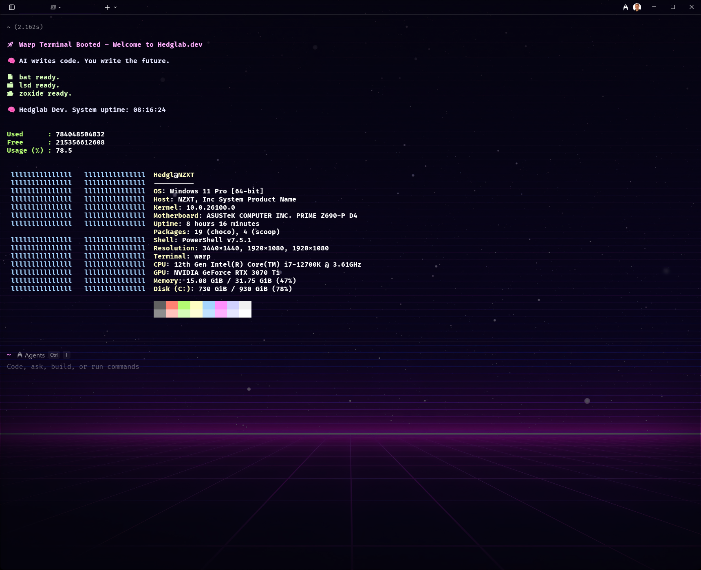

<h1 align="center">Warp_Setup 🚀</h1>

<p align="center">
  <a href="#-install-instructions">
    
  </a>
  <a href="./powershell/Microsoft.PowerShell_profile.ps1">
    
  </a>
  <a href="./oh-my-posh/hedglab.omp.json">
    
  </a>
  
</p>

<p align="center"><em>⚡ Custom Hedglab.dev terminal setup powered by Warp + PowerShell</em></p>

<p align="center">
  
</p>


---

## 📦 What's Included

- `Microsoft.PowerShell_profile.ps1` → Your fully styled terminal brain  
- `hedglab.omp.json` → Custom Oh My Posh prompt  
- `install.ps1` → One-command setup script

---

## 🌸 Install Instructions

```powershell
git clone https://github.com/hedglen/Warp_Setup.git
cd Warp_Setup
.\install.ps1
