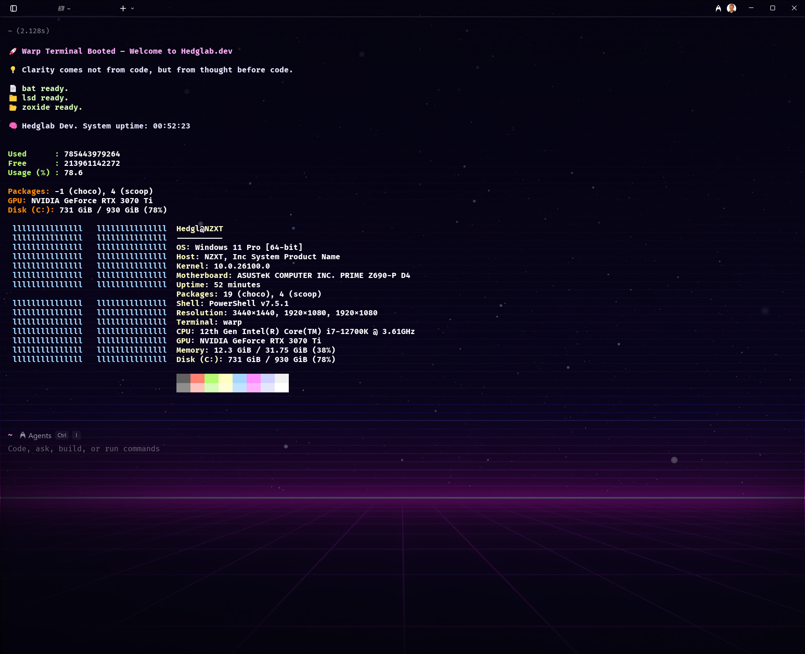

# Warp_Setup 🚀

Your personalized PowerShell + Warp terminal setup.

## What's Included
- `Microsoft.PowerShell_profile.ps1` → Your fully styled terminal brain
- `hedglab.omp.json` → Custom Oh My Posh prompt
- `install.ps1` → One-command setup script

<p align="center">
  
</p>

## 🧠 Install Instructions

```powershell
git clone https://github.com/hedglen/Warp_Setup.git
cd Warp_Setup
.\install.ps1
